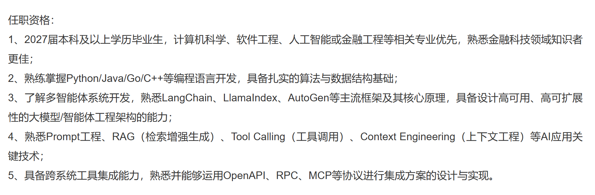
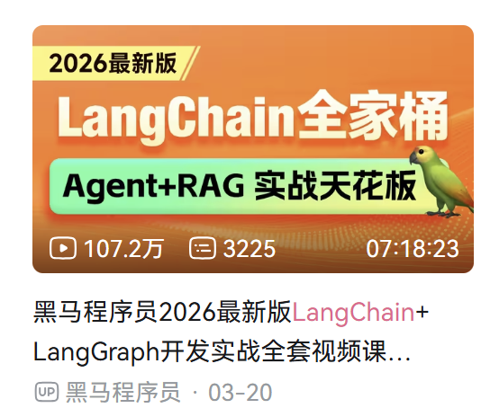
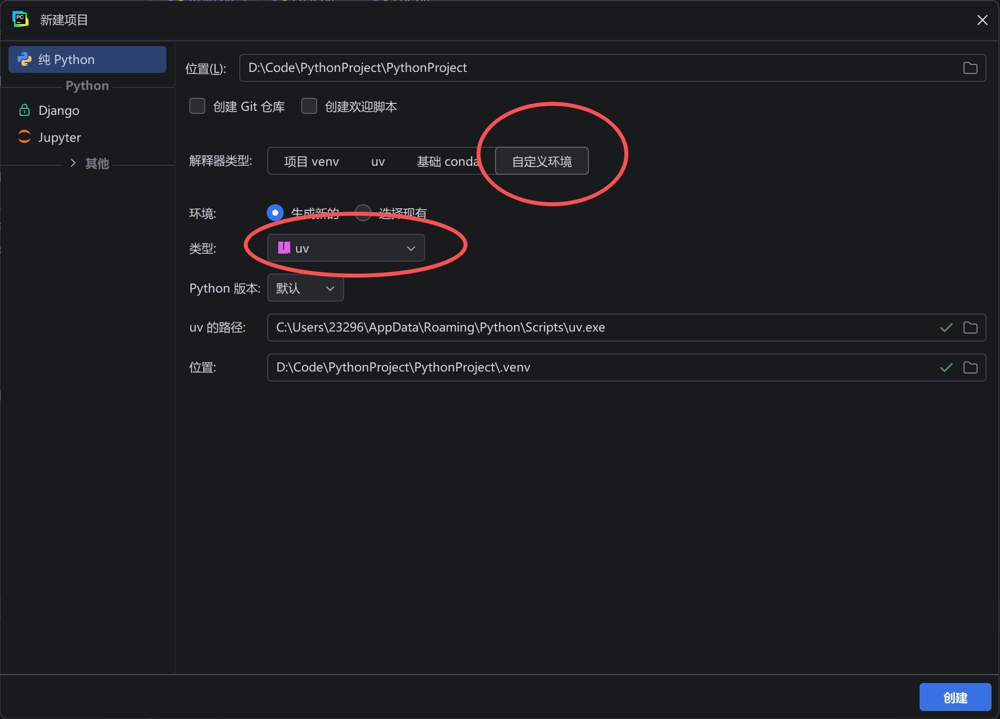

```plain
title: 两天做了一个AI导游，再也不用担心怎么规划旅行了！
subtitle: 朋友用了说豆包太笨了，还是我的AI好用🤣
date: 2026-06-14
```

**Hello there, welcome back to EthanYuan's blog **

​																										**— let's continue sharing my experience.**

最近刷实习岗位，满屏都是“AI应用开发”，回头看看自己那个用 Java+SpringBoot跟着课程自学的《昴云相册》，突然觉得它像一台老式收音机——能响，但不够酷。

实际上我在刷Java实习时，感觉刷不到什么很优质的JD，纯Java怕是真要跟不上时代了。于是我翻资料、啃LangChain，花两天硬怼出一个能对话、能调用工具的Agent。

没想到给朋友一用，他直接抛弃豆包，非要拿我的demo规划他的韩国旅行。至于我怎么从零上手LangChain的？下面我会详细展开。

### 开发项目之前，我都经历了什么？
事情要从错过暑期实习说起。那段时间焦虑得像热锅上的蚂蚁，本来想着“算了，冲一下Java实习吧”，于是疯狂背八股文，项目丢一边——典型的本末倒置。结果刷了一圈Boss直聘，发现Java实习岗位少得可怜，而AI应用开发岗倒是遍地开花，每条JD都赫然写着：“熟练Python、LangChain、LangGraph、RAG，有个人AI项目优先”。我看着自己那个用Spring AI写的情感咨询助手，陷入了沉思。



那个情感咨询助手——我参考OpenManus的四层架构，硬是给它塞了ReAct能力，还能调用高德地图MCP规划约会地点。听起来挺唬人对吧？但实际调用成功率只有10%不到，动不动就崩，别说拿去面试了，我自己都不敢打开。（所以我后面直接放弃维护了）

再就是，智能体项目应该作为后端项目的一个智能模块，不太建议单独拿出来单独做一个项目，这会让人感觉是一个玩具demo项目，而不是真正去解决了问题的智能体项目。

所以我打算先去跟课程系统学习智能体应用开发，有了基本认知和框架后，才能自定义自己的智能体应用，而我落实学习内容的方式就是——做一个能工具调用的Agent demo，AI私人导游

### 怎么去学？
那当然是先去B站大学找课程学习。

你可能会问，为什么第一步先去B站？原因很简单：黑马程序员有现成的课程，能让我少走弯路。就算我英语阅读能力还行，直接啃官方文档——零基础的情况下——也只能是一头雾水，连该查什么都搞不清楚。



但说来好笑，我其实嫌1.5倍速都太慢。于是试着先去瞄一眼官方文档，结果发现：咦？好像能看懂？再结合文字教程对照着看，效率居然比刷视频高出一大截。那种感觉就像本来准备等电梯去5楼，结果发现自己爬上去反而更快。

于是我做了一个干脆的决定：放弃视频，直接硬啃文字教程和官方文档。视频还没更完？不关心了。老师还没讲到后面？不等了。从那一刻起，我的学习路径彻底从“被动看”变成了“主动查”——而这恰恰是我能一个白天搓出一个AI导游的关键。

### 我具体是怎么开发的？
光下面我完整走一遍从零开始开发这个旅行规划助手的技术流程，不贴大段代码，只讲清楚每一步在干什么。

第一步是环境。我按黑马文档推荐的，先装了一个叫uv的Python包管理工具，然后打开PyCharm，新建项目时直接选“uv管理依赖”。这一步的好处是，依赖安装快、隔离干净，省得以后跟系统Python打架。



接着新建两个文件：requirements.txt把要用到的依赖全列上——LangChain、LangGraph、FastAPI、python-dotenv等等，一次性装好，避免后面边写边报“ModuleNotFoundError”的崩溃。另一个是.env，专门用来存API Key、Base URL这些打死也不能写死在代码里的秘密。

模型初始化这块，LangChain对DeepSeek封装得特别友好。我直接写ChatDeepSeek(model="deepseek-v4-flash")，它自己会去读.env里的密钥和地址，一行代码搞定。如果你用通义千问这类模型，就得用init_chat_model()，手动传三个参数：model、api_key、base_url。

```python
# LangChain支持
llm = ChatDeepSeek(model = "deepseek-v4-flash")

# LangChain不支持
llm = init_chat_model(
	model = "qwen3.7-plus",
    api_key = "",
    base_url = ""
)
```

本地调试少不了对话记忆。我配置了checkpointer，用SQLite存储会话文件——轻量、不用装数据库，特别适合在笔记本上跑。

在 LangSmith 里调试 Agent 时，使用一个内存+本地磁盘的简易 checkpointer，数据存在 .langgraph_api/ 目录下。你不需要自己配置，它自动就有了，所以 checkpointer 完全可以省略。

一旦要对接前端页面，实现真正的多轮对话，就必须引入 checkpointer 来持久化会话状态，否则用户聊完第二句，Agent 就忘了第一句说了什么。下面是我基于Sqlite创建的checkpointer：

```python 
import os
import sqlite3
from langgraph.checkpoint.sqlite import SqliteSaver
from app.common.logger import logger

def get_sqlite_checkpointer(db_path: str = "db/my_guide.db"):
    # 确保目录存在
    os.makedirs(os.path.dirname(db_path), exist_ok=True)
    
    # 建立同步连接
    conn = sqlite3.connect(db_path, check_same_thread=False)
    logger.info("SQLite connection 完成 ....")
    
    # 初始化 SqliteSaver
    checkpointer = SqliteSaver(conn=conn)
    # 自动建表
    checkpointer.setup()
    logger.info("Checkpointer 初始化完成 ....")
    
    return checkpointer
```

在提示词设计上，要设定角色（旅行规划助手）、边界约束（别乱推荐不存在的酒店）、任务执行流程（先问目的地、日期、偏好，再调用工具查景点和路线）。写得太松，它会胡说八道；写得太死，又像个傻子。

这里我提一嘴我踩的坑：

用Kiwi MCP查机票的时候，我踩了两个坑。第一个是语言参数，Kiwi本身擅长查国际航班，但如果不显式约束成zh-cn，它可能会传进乱七八糟的参数直接报错。更麻烦的是，价格默认以欧元展示，看着实在别扭，所以必须在提示词里强制指定用人民币。

第二个坑是日期格式，AI经常把用户说的“下周五”理解成某个不规范的字符串，甚至误判为过去日期。必须用ISO标准YYYY-MM-DD约束死，否则航班永远查不出来。这两个小坑卡了我半小时，加进提示词后就解决了。

```python 
system_prompt = """
# 角色定义
你是一名专业的旅行规划助手，名为“小昴”。你的职责是为用户提供准确、可执行的旅行建议，包括航班查询、景点推荐及行程规划。

# 可用工具
- kiwi-com-flight-search：用于航班查询。调用时语言参数使用 zh-cn，货币单位使用人民币（CNY）。
- web_search：用于景点及攻略查询，获取实时景点信息、游玩建议、用户评价等。

# 航班查询规范
1. 日期格式必须为 ISO 8601 标准：YYYY-MM-DD
2. 年份推断规则：
   - 若用户未指定年份，且目标月份晚于当前月份，则使用当前年份
   - 若用户未指定年份，且目标月份早于或等于当前月份，则使用下一年份
3. 出发日期必须严格晚于当前系统时间，不接受过去日期

# 景点处理流程
当用户提供景点名称或图片时，按以下步骤执行：

**第一步：实体识别**
提取景点完整名称及所属地区（省/市/国家）。

**第二步：信息检索**
调用 web_search 获取以下维度信息：
- 游玩时长建议
- 核心亮点与特色
- 实用贴士（门票、交通、最佳季节等）

**第三步：同类推荐**
检索相似景点（同类型、同地区或同主题），按以下权重排序：
- 用户口碑（评分及评价数量）
- 热门程度（搜索热度及访问量）
- 出行便捷度（交通可达性）

**第四步：结构化输出**
按以下格式输出结果：

【景点名称】
- 位置：
- 游玩建议：
- 核心亮点：
- 实用贴士：

【同类推荐】
1. 景点A + 推荐理由
2. 景点B + 推荐理由

# 约束条件
1. 禁止编造工具返回结果中不存在的信息
2. 若工具调用失败或返回空结果，明确告知用户并建议替代方案
3. 不执行超出旅行规划范畴的操作
"""
```


主角是create_agent。把上面准备好的大模型、工具列表（MCP的那些查天气、搜景点、算距离的工具）、checkpointer还有系统提示词一股脑传进去，一个能对话、能调用工具的智能体就诞生了——全程不超过10行核心代码。

可能大家会有疑问：为什么同时引入工具与MCP要写成下面这样，那直接把MCP工具写在列表里不是更美观吗？

💡原因就是代码里已经写有tool了，而MCP是在客户端启动时连接服务器才能加载到工具的，编码阶段Agent是无法获取MCP包含的工具的，如果直接写进列表里会报错

```Python
agent_instance = create_agent(
        model=llm,
        tools=[web_search] + mcp_tools, # 引入工具与MCP的标准写法
        system_prompt=system_prompt,
        checkpointer=cp
    )
```


调试阶段我用上了LangSmith。在终端敲langgraph dev，它会自动启动一个本地Web界面，你可以看到每一次LLM调用、工具返回、Token消耗，甚至哪一步错了都能精确定位。比起之前对着print瞎猜，这简直是降维打击。

最后是和前端对接。我用FastAPI写了chat.py，里面一个/chat接口接收用户消息、调用Agent、返回回复。在main.py里初始化FastAPI，写了个lifespan事件——启动时建立数据库连接和Agent实例，关闭时优雅清理。然后用include_router把路由挂到/api前缀下，最后uvicorn.run指定端口、开启reload=True热重载。改完代码自动更新，不需要重启项目。

至此，我的旅行规划助手从0到1跑通了全链路。前后其实没花几天，但自己动手把每个环节踩一遍，比看十遍教程都管用。

### 最后的话
回头看看这两天的经历，其实挺魔幻的。从一个为暑期实习焦虑、疯狂背八股文的“Java选手”，到两天手搓出一个朋友宁愿抛弃豆包也要用的AI导游——这中间最大的变量，就是迈出第一步，然后硬着头皮把坑一个个踩完。

LangChain没你想的那么难，官方文档也没那么可怕。关键是别等“准备好了”再动手，先跑通一个最简单的demo，再慢慢往里塞东西。至于《昴云相册》的智能体改造？那是下一个故事了。

补充前面没说的，学新项目新技术还有两点原因：

1、因为当前AI应用开发的核心是构建复杂的AI Agent和RAG流程，LangChain在此领域生态更成熟、功能更灵活，已成为市场主流；而Spring AI更像一个为Spring开发者服务的“甜点”，在招聘需求和技术前沿性上远不及前者。

2、就个人体验来说，LangChain开发比Spring AI顺手，几乎所有常用组件都是开箱即用，我列举一下最解决我痛点的几个案例：

1. 生态组件开箱即用，大幅简化集成成本：<font style="color:rgb(15, 17, 21);background-color:rgb(235, 238, 242);">langgraph-checkpoint-redis</font>就是典型例子。相比Spring AI需要手动配置Redis连接、编写<font style="color:rgb(15, 17, 21);background-color:rgb(235, 238, 242);">RedisTemplate</font>和序列化逻辑，LangChain生态提供了封装好的<font style="color:rgb(15, 17, 21);background-color:rgb(235, 238, 242);">RedisSaver</font>，只需几行代码即可将复杂的状态持久化与Redis无缝集成，避免了重复造轮子。
2. 高层抽象与AI编程工具协同，降低复杂智能体开发门槛：<font style="color:rgb(15, 17, 21);background-color:rgb(235, 238, 242);">create_agent</font>这类高层API封装了ReAct、工具调用等复杂模式。配合通义灵码等AI编程助手，你可以通过自然语言快速生成、理解和修改基于LangGraph的工作流代码。相比之下，从零仿制OpenManus架构时，我需要手动处理大量底层逻辑，学习成本和调试难度都显著更高。
3. 工作流编排能力灵活强大，满足高度定制化需求：LangGraph提供图结构的Agent工作流编排，让我能像搭积木一样精细控制每一步的决策、循环和状态传递。这种显式的、模块化的设计，使得我在实现复杂自主规划（如多步推理、动态工具选择）时，可以轻松插入自定义逻辑，而不会像盲目跟敲项目时那样，对整体流程失去掌控感。

Anyway，代码写完了，朋友也玩上了。如果你也在折腾AI应用，希望这篇能给你一点动力。下篇见。


